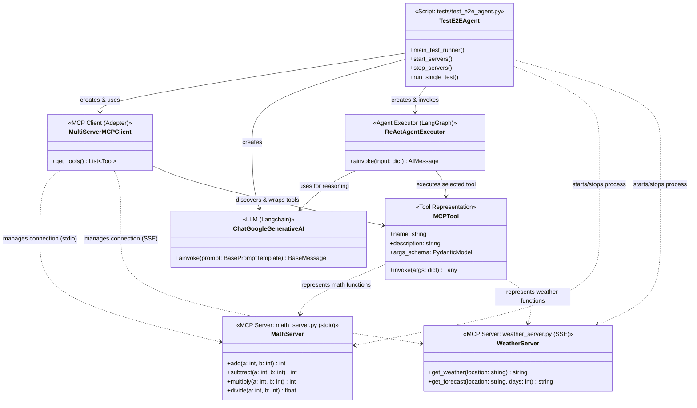
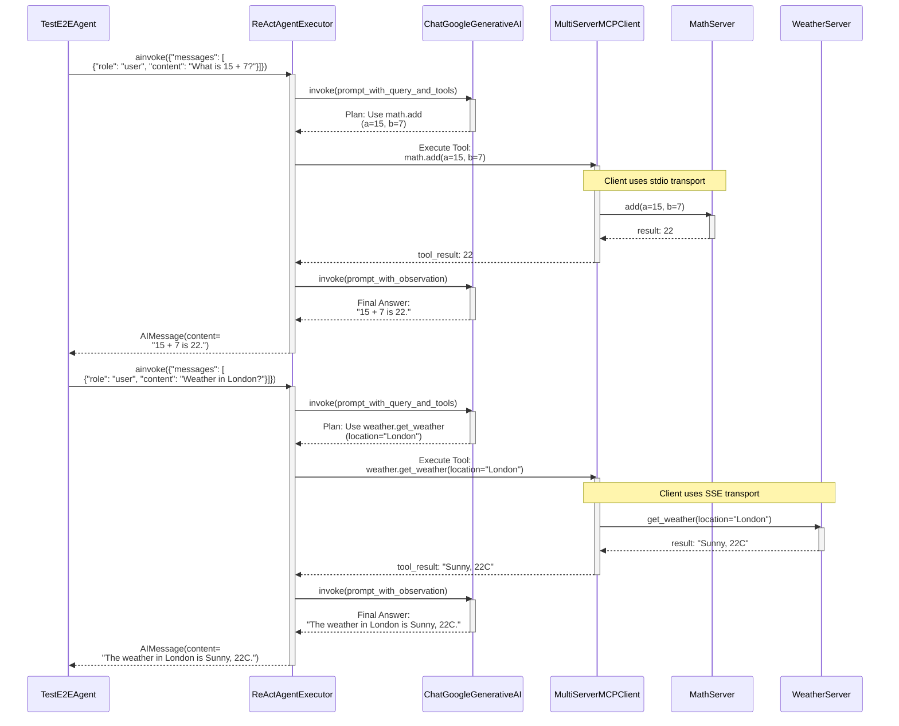
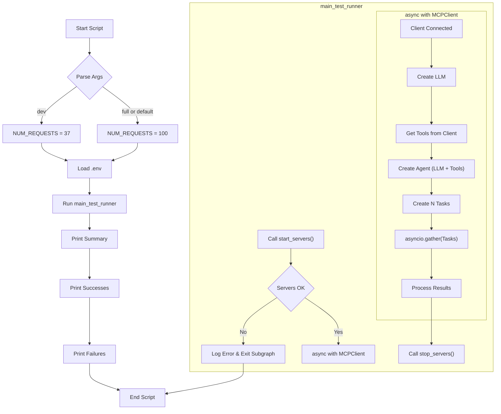

# System Architecture and Agent Tutorial

This document explains the architecture of the LangOctopus MCP example and how the agent uses the different components.

## System Diagram (Mermaid UML Class Diagram)



## Sequence Diagram (Example Queries)

This diagram shows the typical flow of interactions when the agent processes different types of queries.



## Flowchart (E2E Test Script Logic)

This flowchart outlines the overall execution flow of the `tests/test_e2e_agent.py` script.



## How the Agent Selects and Calls MCP Tools

The core of the agent logic resides in the `ReActAgentExecutor`, created using LangGraph's `create_react_agent` function. This agent uses the ReAct (Reasoning and Acting) framework to interact with tools and achieve goals based on user input. Here's the process:

1.  **Initialization:** The `TestE2EAgent` script initializes the `MultiServerMCPClient`. This client connects to the running `MathServer` (via stdio) and `WeatherServer` (via SSE).
2.  **Tool Discovery:** The `MultiServerMCPClient` automatically discovers the functions exposed by each connected MCP server. It uses the `mcp` protocol to get the function names (e.g., `add`, `get_weather`), their docstrings (which become descriptions), and type hints (to generate argument schemas). It wraps these discovered functions into `MCPTool` objects (which are compatible with Langchain tools).
3.  **Agent Setup:** The `TestE2EAgent` script retrieves the list of `MCPTool` objects from the client using `mcp_client.get_tools()`. It then creates the `ReActAgentExecutor`, providing it with the `ChatGoogleGenerativeAI` model (Gemini) and the discovered list of `MCPTool`s.
4.  **Receiving a Query:** When the agent's `ainvoke` method is called with a user query (e.g., "What is 5 times 12?", "What's the weather in Paris?"), the ReAct loop begins.
5.  **Reasoning (Thought):** The `ReActAgentExecutor` sends the query and the descriptions of the available tools (`MCPTool` list) to the Gemini LLM. The LLM analyzes the query and the tool descriptions.
6.  **Tool Selection (Action Planning):** Based on the query's intent, the LLM decides which tool is most appropriate. For "What is 5 times 12?", it identifies the `math.multiply` tool. For "What's the weather in Paris?", it selects the `weather.get_weather` tool. The LLM also determines the arguments needed for the selected tool (e.g., `a=5, b=12` for multiply; `location="Paris"` for weather).
7.  **Execution (Action):** The `ReActAgentExecutor` executes the chosen `MCPTool` with the arguments determined by the LLM. The `MCPTool` wrapper handles calling the actual function on the correct remote MCP server (`MathServer` or `WeatherServer`) via the `MultiServerMCPClient` and the appropriate transport (stdio or SSE).
8.  **Observation:** The result from the MCP server is returned to the `ReActAgentExecutor`.
9.  **Final Answer Generation (Thought):** The agent sends the observation (the tool's result) back to the LLM. The LLM processes the result and formulates a final, user-friendly answer (e.g., "5 times 12 is 60.", "The weather in Paris is currently sunny.").
10. **Response:** The `ReActAgentExecutor` returns the final answer.

Essentially, the LLM acts as the central router, using the descriptions provided by the MCP tools to decide which specialized service (Math or Weather) to delegate the task to.

## MCP Servers (`math_server.py` and `weather_server.py`)

These Python scripts act as simple microservices exposing specific functionalities over the MCP protocol.

*   **`math_server.py`:**
    *   Imports the `mcp` library.
    *   Defines standard Python functions for arithmetic operations (`add`, `subtract`, `multiply`, `divide`).
    *   Includes type hints and docstrings for these functions. These are crucial as MCP uses them for tool discovery and schema generation.
    *   In its `if __name__ == "__main__":` block, it calls `mcp.run(transport="stdio")`. This starts the MCP server, making the defined functions available for remote calls over standard input/output. The `MultiServerMCPClient` is configured to launch this script as a subprocess and communicate with it via stdio.

*   **`weather_server.py`:**
    *   Imports the `mcp` library.
    *   Defines functions like `get_weather` and `get_forecast`. These currently return mock data but demonstrate the structure.
    *   Includes type hints and docstrings.
    *   In its `if __name__ == "__main__":` block, it calls `mcp.run(transport="sse")`. This starts the MCP server using Server-Sent Events (SSE) for communication, typically running as a standalone web server process (by default on port 8000, though the client connects via the specified URL `http://localhost:8000/sse`). The `MultiServerMCPClient` is configured to connect to this server's SSE endpoint URL.

The `mcp.run()` function handles the protocol details, listening for incoming requests, dispatching them to the correct Python function, and sending back the results according to the specified transport mechanism. 

## MCP Server Function Definitions

Below are the actual Python functions defined in the MCP servers, decorated with `@mcp.tool()`. This decorator, along with the function's docstring and type hints, provides the metadata that the `MultiServerMCPClient` uses during the **Tool Discovery** step mentioned above.

### `math_server.py`

```python
from mcp.server.fastmcp import FastMCP

mcp = FastMCP("Math")

@mcp.tool()
def add(a: int, b: int) -> int:
    """Add two numbers"""
    return a + b

@mcp.tool()
def multiply(a: int, b: int) -> int:
    """Multiply two numbers"""
    return a * b

@mcp.tool()
def subtract(a: int, b: int) -> int:
    """Subtract b from a"""
    return a - b

@mcp.tool()
def divide(a: int, b: int) -> float:
    """Divide a by b"""
    if b == 0:
        # MCP automatically handles standard exceptions
        # converting them into protocol-level errors.
        raise ValueError("Cannot divide by zero")
    return a / b

# The if __name__ == "__main__": block starts the server
# with mcp.run(transport="stdio")
```

### `weather_server.py`

```python
from mcp.server.fastmcp import FastMCP

mcp = FastMCP("Weather")

@mcp.tool()
def get_weather(location: str) -> str:
    """Get weather for a location"""
    # Placeholder for real API call
    return f"It's currently sunny and 22°C in {location}."

@mcp.tool()
def get_forecast(location: str, days: int = 3) -> str:
    """Get weather forecast for a location for the next few days"""
    # Placeholder for real API call
    # ... (random forecast generation logic) ...
    import random
    weather_patterns = [
        "sunny with occasional clouds",
        "partly cloudy with light rain",
        "overcast with heavy rain",
    ]
    pattern = random.choice(weather_patterns)
    return f"{days}-day forecast for {location}: Expect mild temperatures around 20-25°C with {pattern}."

# The if __name__ == "__main__": block starts the server
# with mcp.run(transport="sse")
```

## Additional MCP Examples/Patterns

While this example uses basic request/response with primitive types, MCP supports more advanced patterns:

*   **Complex Data Types (Pydantic):** You can use Pydantic models for arguments and return types. MCP automatically generates JSON schemas for them.

    ```python
    from pydantic import BaseModel
    from mcp.server.fastmcp import FastMCP

    mcp = FastMCP("UserData")

    class User(BaseModel):
        user_id: int
        name: str
        is_active: bool

    class StatusResponse(BaseModel):
        message: str
        user_status: dict

    @mcp.tool()
    def update_user(user_data: User) -> StatusResponse:
        """Updates user information based on input model."""
        print(f"Updating user {user_data.user_id}: {user_data.name}")
        # ... database logic ...
        return StatusResponse(
            message=f"User {user_data.user_id} updated.", 
            user_status=user_data.dict()
        )
    ```

*   **Error Handling:** As shown in the `divide` function, raising standard Python exceptions within an `@mcp.tool()` function is the standard way to signal errors. MCP intercepts these and translates them into appropriate error responses in the protocol, which the client can then handle.

*   **Streaming Responses:** While not explicitly used here for complex logic, the SSE (Server-Sent Events) transport used by the `WeatherServer` is inherently a streaming protocol. For tools that generate results incrementally (like a long LLM response), you could `yield` results from your function instead of returning a single value. MCP over SSE would stream these yielded chunks to the client.

    ```python
    # Example (Conceptual - requires client-side handling of streamed chunks)
    @mcp.tool()
    def generate_report(topic: str) -> str: # Return type might vary for streaming
        """Generates a multi-part report, streaming sections."""
        yield "Section 1: Introduction to {topic}\n"
        # ... time consuming step 1 ...
        yield "Section 2: Analysis of {topic}\n"
        # ... time consuming step 2 ...
        yield "Section 3: Conclusion for {topic}\n"
    ```

*   **Different Transports:** This example uses `stdio` and `sse`. MCP also supports other transports like WebSockets (`ws`) which could be used depending on the specific client-server interaction needs. 